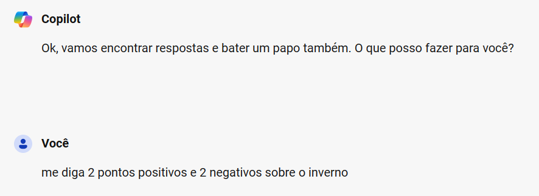
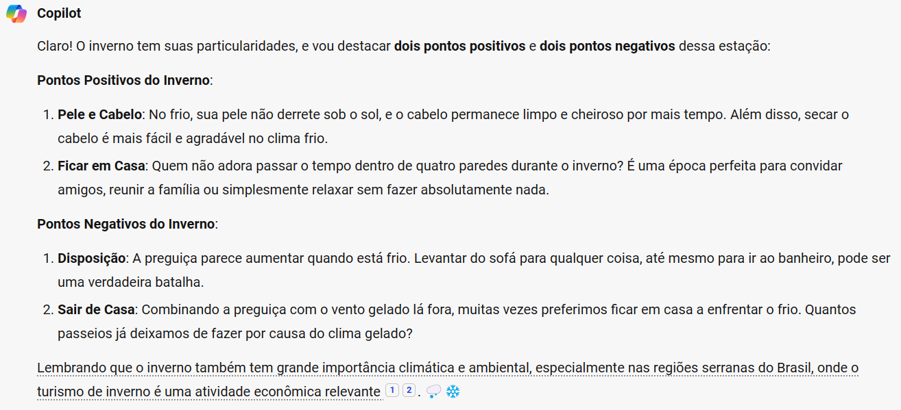

# Explorando os Recursos de IA Generativa com Copilot e OpenAI

Um pouco sobre como explorar recursos da Inteligência Artificial (IA) para gerar texto ou imagens usando o Copilot

## Gerando imagens

## Gerando conversas

## Gerando Códigos 

